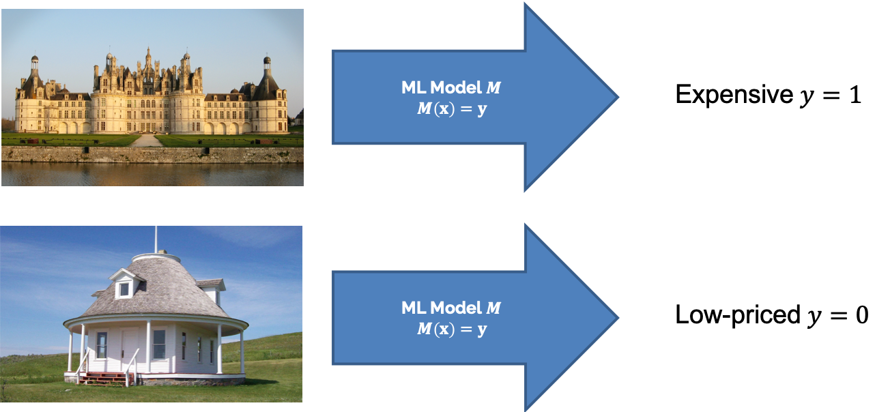
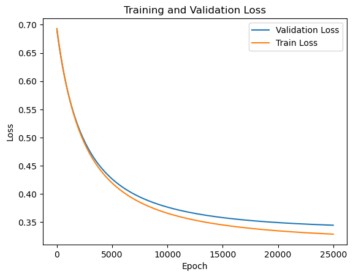
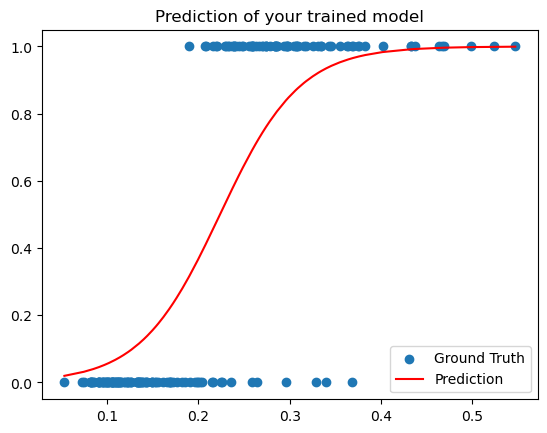
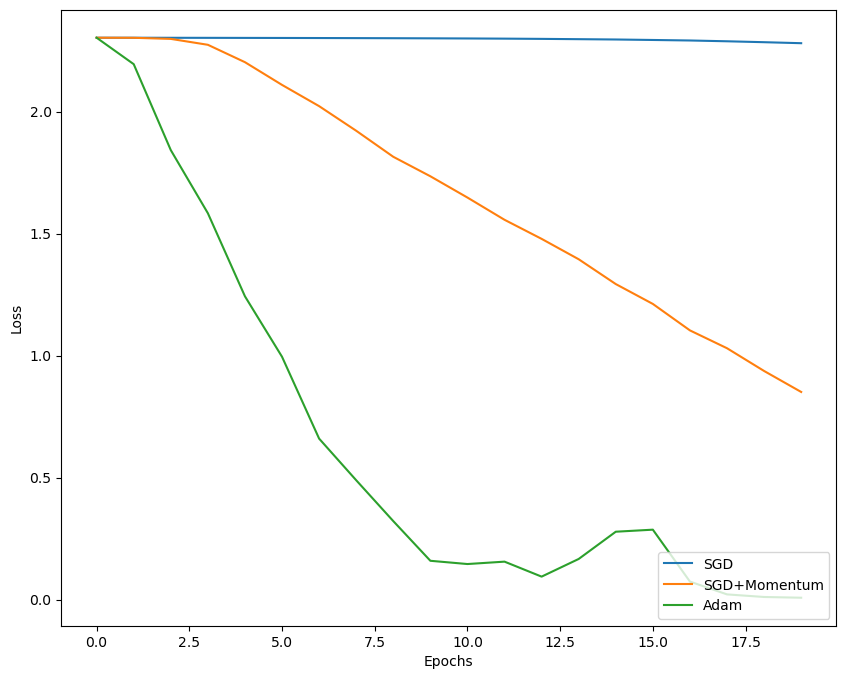

# Introduction to Deep Learning

## Outline
---

- Dataset and Dataloader Classes
- House Prices Classification Using Logistic Regression
- Image Classification on CIFAR-10 Using Neural Network
- Handwritten Digits Classification on MNIST Using Autoencoder
- Facial Keypoint Detection Using Convolutional Neural Network
- Semantic Segmentation using Convolutional Neural Network

## Dataset and Dataloader Classes
---

- Visualization
- Preprocessing
- Normalization
- Dataloader

## House Prices Classification using Logistic Regression
---

Categorizing houses into ```low-priced``` or ```expensive``` using simple logistic regression model. The data that we will use here is the HousingPrice dataset. Feeding some features in our classifier, the output should then be a score that determines in which category the considered house is.


### Binary Cross Entropy Loss
- forward pass: returns BCE loss
- backward pass: returns the gradient of the input to the loss function w.r.t to predicted y.

### Backpropagation
- sigmoid: activation function
- forward pass: returns predicted output, compute forward pass for each layer, save in cache for backward pass
- backward pass: returns the gradient of the weight matrix w.r.t. the upstream gradient

### Optimizer and Gradient Descent
- step: A vanilla gradient descent step. returns updated weight after one step

### Solver
- step: performs a forward pass, calculates the loss, backward pass, tells the optimizer to update the weights by 1 step




## Image Classification on CIFAR-10 Using Neural Network
---

### Modularization
Using the chain rule, the model could be split into layers by using a `forward` and `backward` pass. The forward and backward passes are define according to the function of each layer as explained in the following sections.

### Sigmoid
- `forward`: given an input `X` of any shape, calculate the `Sigmoid` function for it and cache the input. Afterwards, return the `output` and `cache`.
- `backward`: given `upstream gradient dout` and `cache`, calculate `gradient w.r.t X`

### ReLU
- `forward`: given an input `X` of any shape, calculate the `ReLU` function for it and cache the output. Afterwards, return the `output` and `cache`.
- `backward`: given `upstream gradient dout` and `cache`, calculate `gradient w.r.t X`

### Affine Layers
- `forward`: given `x`, `w`, `b`, calculate the affine output and cache inputs. Return `output` and `cache`.
- `backward`: given `upstream gradient dout` and `cache`, calculate and return `dx`, `dw`, `db`.

### N-Layer Classification Network
- `forward`: given input data `X` containing `N` minibatches, calculate `affine forward`, `activation forward`. Return predicted value. Notice that last layer has only `affine forward` because the `activation forward` is included in the `cross-entropy/softmax`.
- `backward`: given `gradient w.r.t network output dy`, calculate `activation backward`, `affine backward`. Afterwards, return the `gradients w.r.t. model weights`

### Cross-Entropy/Softmax Loss from Logits
- `forward`: given `y_out logits`, `y_truth`, transform `logits` into a distribution using `softmax` while maintaining numerical stability. return `loss`.
- `backward`: given `y_out`, `y_truth`, return `cross-entropy loss gradients w.r.t. y_out`

### SGD + Momentum
- `update`: given `w`, `dw`, calculate new `v`, and updated wieghts `next_w`.

### Adam
- `update`: given `w`, `dw`, `config`, `lr`, return `next_w`, `config`.



## Handwritten Digits Classification on MNIST Using Autoencoder
---

MNIST dataset contains 60,000 images of handwritten digits. The first task is to train an autoencoder to reproduce these unlabeled images. Afterwards, the weights of the pre-trained encoder is transferred and fine-tuned on a classifier using the available labeled data.


### Classifier
- The encoder uses linear layers that map to latent space.
- The classifier is concatenated to the encoder, where it takes latent space input and classifies into digits classes. The classifier uses a block of fully connected layers.

### Training and validation
Achieved by performing forward pass, backward pass, then an update of weights.

## Facial Keypoint Detection Using Convolutional Neural Network
---

## References
---
[Python Tutorial](https://docs.python.org/3/tutorial/)

[NumPy Tutorial](http://cs231n.github.io/python-numpy-tutorial/)

[Chain Rule TUM](https://bit.ly/tum-article)

[Chain Rule Stanford](http://cs231n.stanford.edu/handouts/linear-backprop.pdf)

[One-Hot Encoding](https://machinelearningmastery.com/why-one-hot-encode-data-in-machine-learning/)

[Logits](https://datascience.stackexchange.com/questions/31041/what-does-logits-in-machine-learning-mean/31045)

[Softmax](https://en.wikipedia.org/wiki/Softmax_function)

[Adam](https://ruder.io/optimizing-gradient-descent/)